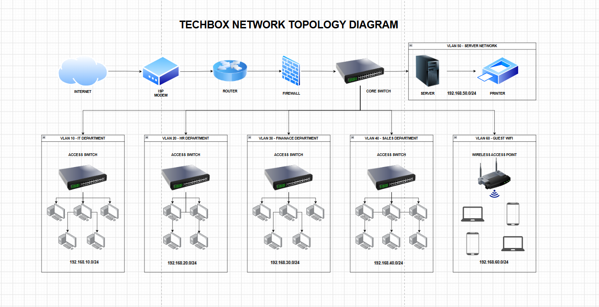

### Author

**Student Name:** Precious Rondilla
**Course:** BSIT 4D
**Subject:** System Administration
**Project:** Week 2 — Enterprise IT Infrastructure Planning

## Table of Contents

* [Project Overview](#project-overview)
* [Learning Objectives](#learning-objectives)
* [Company Scenario](#company-scenario)
* [Hardware Inventory](#hardware-inventory)
* [Software Inventory](#software-inventory)
* [Network Design](#network-design)
* [Network Diagram](#network-diagram)
* [Technologies Used](#technologies-used)
* [System Administration Roles](#system-administration-roles)
* [Infrastructure Recommendations](#infrastructure-recommendations)
* [Challenges Encountered](#challenges-encountered)
* [Reflection](#reflection)
* [Project Structure](#project-structure)
* [References](#references)

---

## Project Overview

This project presents an IT infrastructure plan for TechBox, a small software development company with 20 employees.

TechBox currently has no computers, server, network, internet infrastructure, or security policies. This project provides a basic plan for building the company's IT environment from the beginning.

The plan includes:

* Company profile
* Hardware inventory
* Software inventory
* Network inventory
* Network diagram
* System administration roles
* Security recommendations
* Backup strategy
* Future expansion plan

---

## Learning Objectives

Through this project, I learned how to:

* Create a company IT profile.
* Plan hardware and software.
* Create a network inventory.
* Design a network diagram.
* Understand different System Administrator roles.
* Recommend security controls.
* Plan backups.
* Design an infrastructure that can grow.
* Document an IT infrastructure project.

---

## Company Scenario

TechBox is a small software development company with 20 employees.

### Departments

| Department             | Employees |
| ---------------------- | --------: |
| Information Technology |         5 |
| Human Resources        |         4 |
| Finance                |         5 |
| Sales                  |         6 |
| Total                  |         20|

### Business

TechBox develops websites, mobile applications, and IT solutions for clients.

The company needs a complete IT infrastructure to support its employees and business operations.

---

## Hardware Inventory

TechBox will use the following hardware:

| Hardware               | Quantity | Purpose                             |
| ---------------------- | -------: | ----------------------------------- |
| Desktop Computers      |       20 | Main computers for employees        |
| Laptops                |        4 | Portable work and IT support        |
| Server                 |        1 | Store files and run services        |
| Router                 |        1 | Connect the company to the internet |
| Network Switch         |        2 | Connect network devices             |
| Printers               |        2 | Print company documents             |
| UPS                    |        3 | Protect devices from power problems |
| Wireless Access Points |        3 | Provide Wi-Fi                       |
| NAS Storage            |        1 | Store backup files                  |
| External Backup Drives |        2 | Extra backup copies                 |
| Monitors               |       20 | Display for desktop computers       |

---

## Software Inventory

| Software           | Version       | License      | Purpose                   |
| ------------------ | ------------- | ------------ | ------------------------- |
| Windows 11 Pro     | Current       | Paid         | Main operating system     |
| Ubuntu Server      | LTS           | Free         | Server operating system   |
| Microsoft Office   | Microsoft 365 | Subscription | Office work               |
| Visual Studio Code | Current       | Free         | Programming               |
| Git                | Current       | Free         | Version control           |
| GitHub Desktop     | Current       | Free         | Git and GitHub management |
| VirtualBox         | Current       | Free         | Virtual machines          |
| Google Chrome      | Current       | Free         | Web browsing              |
| Microsoft Defender | Built-in      | Included     | Antivirus and security    |
| AnyDesk            | Current       | Free/Paid    | Remote IT support         |
| 7-Zip              | Current       | Free         | File compression          |

---

## Network Design

The proposed network uses a star topology.

The main network path is:

```text
Internet
   ↓
ISP Modem
   ↓
Router
   ↓
Firewall
   ↓
Core Switch
   ↓
Departments / Server / NAS / Printers / Wi-Fi
```

The firewall protects the internal network from outside threats.

Separate VLANs will be used for each department to improve security and organization.

### VLAN Plan

| VLAN    | Department / Use   | Network         |
| ------- | ------------------ | --------------- |
| VLAN 10 | IT Department      | 192.168.10.0/24 |
| VLAN 20 | HR Department      | 192.168.20.0/24 |
| VLAN 30 | Finance Department | 192.168.30.0/24 |
| VLAN 40 | Sales Department   | 192.168.40.0/24 |
| VLAN 50 | Server Network     | 192.168.50.0/24 |
| VLAN 60 | Guest Wi-Fi        | 192.168.60.0/24 |

Using VLANs helps separate departments and protect important company information.

---

## Network Diagram

The network diagram shows how TechBox's devices are connected.



### Network Flow

```text
                         INTERNET
                             |
                        [ISP MODEM]
                             |
                          [ROUTER]
                             |
                         [FIREWALL]
                             |
                       [CORE SWITCH]
                    _________|_________
                   |         |         |
                [SERVER]    [NAS]   [PRINTERS]
                             |
                     [DISTRIBUTION
                        SWITCH]
                    _____|_____|_____
                   |      |      |      |
                  IT      HR   Finance  Sales
                 5 PCs   4 PCs  5 PCs   6 PCs
                   |
             [ACCESS POINTS]
                   |
                Wi-Fi Users
```

> Note: The final diagram should be created in Draw.io and exported as both PNG and PDF.

---

## Technologies Used

| Technology    | Use                          |
| ------------- | ---------------------------- |
| Windows 11    | Employee computers           |
| Ubuntu Server | Server management            |
| TCP/IP        | Network communication        |
| VLAN          | Network separation           |
| Ethernet      | Wired connections            |
| Wi-Fi         | Wireless connections         |
| Firewall      | Network security             |
| Router        | Internet and network traffic |
| Switch        | Connect network devices      |
| Git           | Version control              |
| GitHub        | Project storage              |
| Draw.io       | Network diagram              |

---

## System Administration Roles

### Helpdesk Technician

  Main Responsibilities:

* Help employees with computer problems.
* Install and update software.
* Reset passwords.
* Fix printer problems.
* Provide basic technical support.

  Skills:

* Computer troubleshooting
* Windows
* Basic networking
* Communication
* Problem-solving

---

### Network Administrator

  Main Responsibilities:

* Manage routers and switches.
* Configure Wi-Fi.
* Manage IP addresses.
* Monitor the network.
* Fix network problems.
* Maintain network security.

  Skills:

* TCP/IP
* DNS
* DHCP
* VLANs
* Routing
* Switching

---

### Linux System Administrator

  Main Responsibilities:

* Manage Linux servers.
* Create user accounts.
* Manage files and permissions.
* Install server software.
* Monitor servers.
* Manage backups.

  Skills:

* Linux commands
* Bash scripting
* File permissions
* Networking
* Server management

---

### Cloud Administrator

  Main Responsibilities:

* Manage cloud servers.
* Manage cloud storage.
* Create cloud users.
* Manage permissions.
* Monitor cloud services.
* Manage cloud backups.

  Skills:

* Cloud computing
* Networking
* Security
* Linux/Windows administration
* Backup and recovery

---

## How the IT Professionals Work Together

The four IT professionals work as a team.

The Helpdesk Technician is usually the first person employees contact when they have a problem. If the problem is related to the network, the Network Administrator handles it.

The Linux System Administrator manages the company's Linux server, while the Cloud Administrator manages cloud services and backups.

Working together helps TechBox solve problems faster, protect company data, and keep its IT systems running.

---

## Infrastructure Recommendations

### 1. Internet

TechBox should use a reliable business internet connection with:

* At least 500 Mbps
* Good uptime
* Business support
* Static IP if needed
* Backup internet connection

### 2. Server

Recommended server:

* Xeon or similar CPU
* 32–64 GB RAM
* 2–4 TB storage
* RAID
* Ubuntu Server
* Dual network ports
* UPS protection

### 3. Backup

TechBox should follow the 3-2-1 backup rule:

* 3 copies of important data
* 2 different types of storage
* 1 copy stored in another location or cloud

Example:

```text
Company Files
     |
     +---- Main Server
     |
     +---- NAS Backup
     |
     +---- Cloud / External Backup
```

### 4. Security

TechBox should use:

* Firewall
* Antivirus
* Strong passwords
* Multi-factor authentication
* Regular updates
* User access controls
* Separate VLANs
* Guest Wi-Fi
* Regular backups
* Security awareness training

### 5. Antivirus

Windows computers should use Microsoft Defender or another trusted business antivirus program.

IT staff should make sure that antivirus software is:

* Active
* Updated
* Regularly scanned
* Checked for security alerts

### 6. Password Policy

TechBox should require:

* Strong passwords
* At least 12 characters
* Different passwords for important accounts
* MFA for important accounts
* No password sharing
* Password manager
* Immediate password change after a suspected security problem

### 7. Future Expansion

The network should be ready for **40–50 employees**.

TechBox can expand by:

* Adding more switches
* Adding more access points
* Increasing server storage
* Increasing internet speed
* Moving some services to the cloud
* Improving security controls

---

## Challenges Encountered

The main challenge was planning a complete IT infrastructure from scratch.

I needed to decide what hardware, software, network equipment, security controls, and backup systems TechBox needed.

Creating the network diagram was also challenging because I needed to make sure that all departments and network devices were connected correctly.

---

## Reflection

This project helped me understand how a System Administrator plans and manages an IT environment.

I learned that system administration is not only about fixing computers. It also involves planning hardware, software, networks, security, backups, and user access.

The project improved my knowledge of networking, infrastructure planning, security, documentation, and problem-solving.

It also helped me understand how different IT professionals work together in a real company.

---

## Project Structure

```text
BSIT-SystemAdministration-Portfolio/
│
├── Week02/
│   │
│   ├── EnterpriseInfrastructurePlan.pdf
│   ├── README.md
│   │
│   ├── diagrams/
│   │   ├── NetworkDiagram.png
│   │   └── NetworkDiagram.pdf
│   │
│   ├── images/
│   │   └── screenshots/
│   │
│   └── references/
│       └── References.md
```

---

## References

* Microsoft Documentation
* Ubuntu Documentation
* Cisco Networking Resources
* CompTIA Learning Resources
* Draw.io Documentation

---


